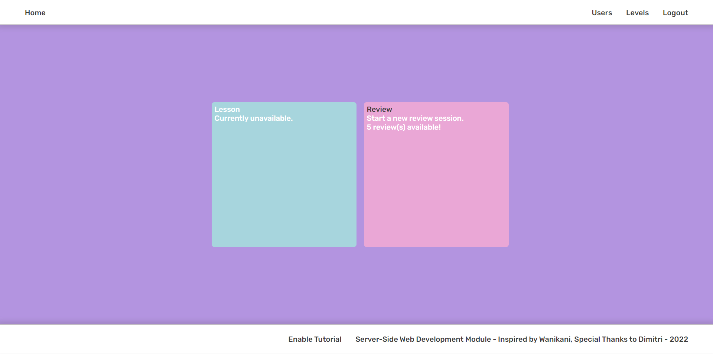
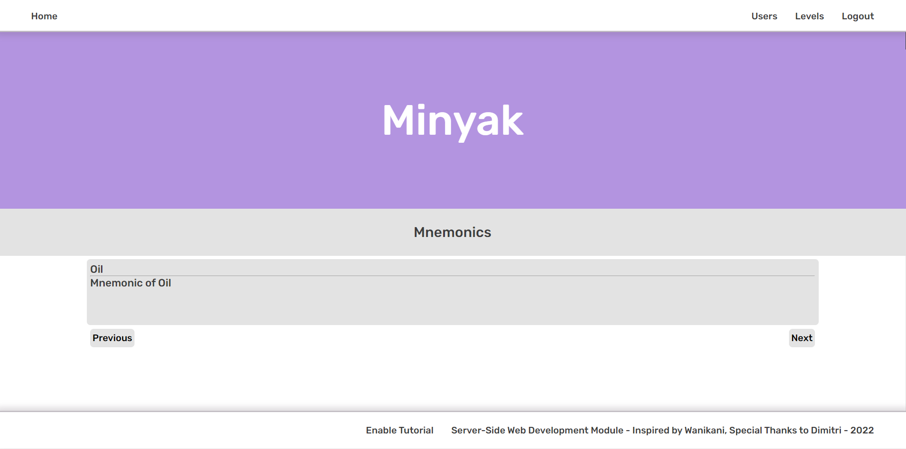
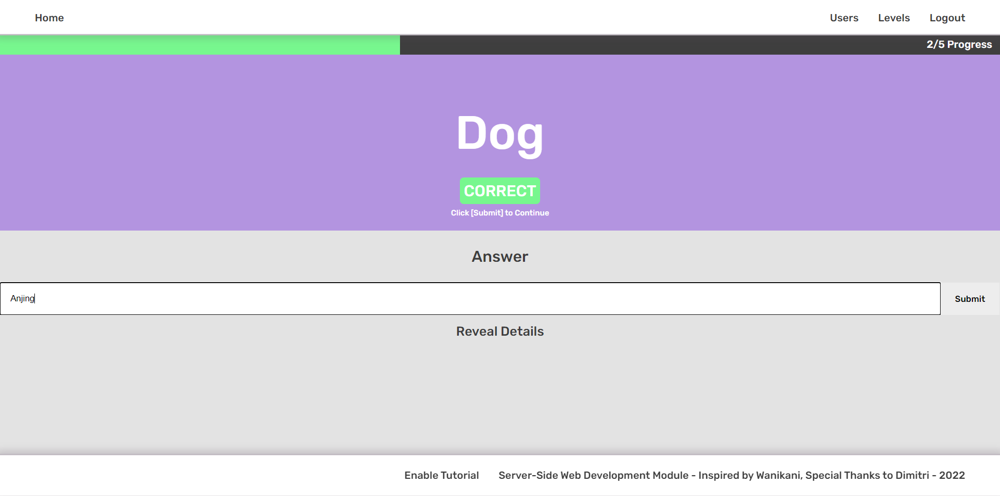
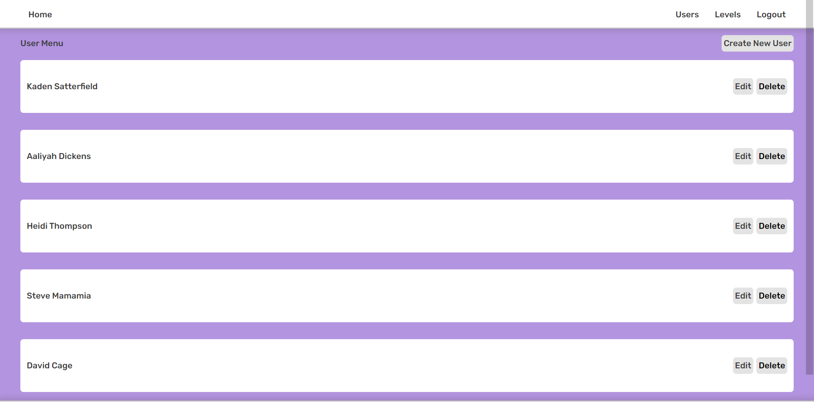
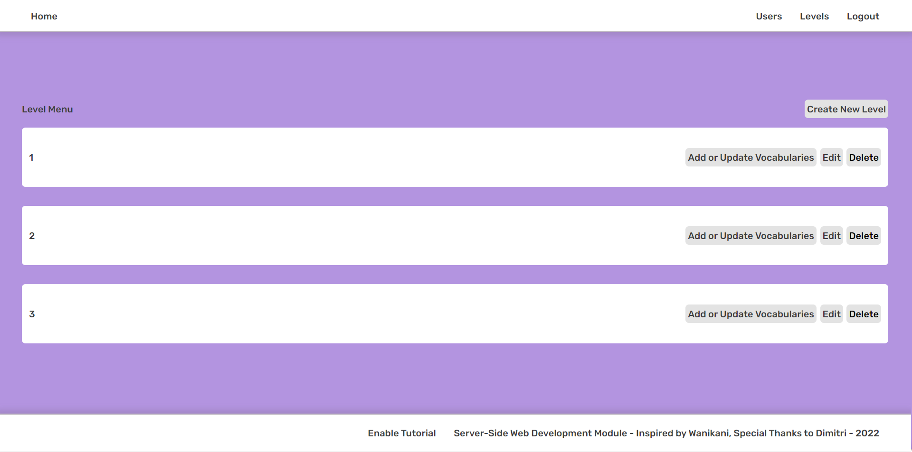
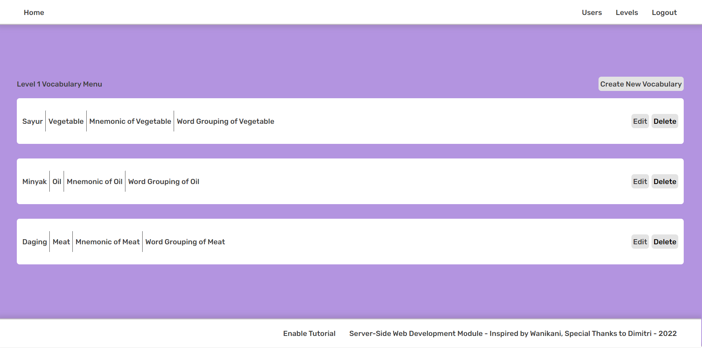

## IND ENG E-Learning Vocab Web App

## What is it?
Indonesian English E-Learning Vocab Web App is a Laravel project created with a goal to aid vocabulary memorization of Indonesian language with English as your native language. 

The web application uses Mnemonic Keyword and Semantic Mapping (future update) to give you easier memorization routes and provides you with a Review Session to recall the words you have learnt.

Although designed with Indonesian and English in mind, Admin can set the language to any language you want.

The website is heavily inspired by Japanese Vocabulary Web Application Wanikani. The website coded here is used for non-commercial and only for study purposes.

## Features
### For Users
### Lesson Session
Users can start a Lesson Session where they will be given Mnemonic Keywords to remember to Semantic Mapping exercises for new Indonesian vocabulary. After they are confident with the new Indonesian words, a Review session will start to help them recall the words.

### Review Session
Review session is created to help users recall the words they have learned from the Lesson Session. After a user has completed a Lesson session, the Indonesian words they learned will be added to the Review session pool. A Review session will take words from this pool and randomize the orders. Review session will show Indonesian or English words and the goal of the user is to type its translation. 

Words are continuously added to the Review Session Pool. As of right now, you cannot remove words you have learnt from Lesson session from the pool.

### For Admins
Admins have the ability to create new users and set their user administration rights.

Admins must divide the words they teach into levels. Each level will contain their Indonesian and English word pairs. This is to pace the user’s studies and avoid overwhelming them.

